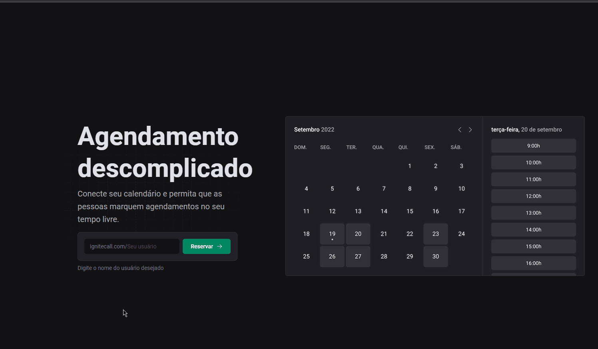
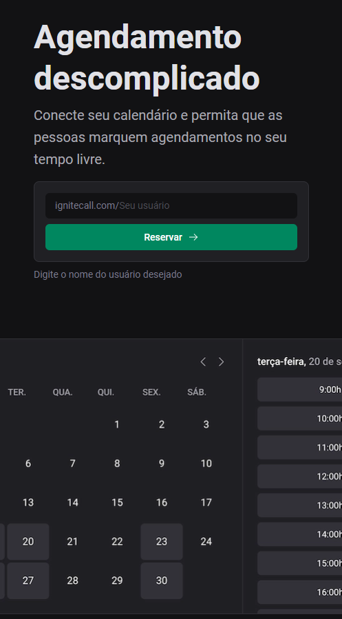

# Ignite Call📅

Projeto em desenvolvimento no 6º e ultimo módulo da trilha React do curso Ignite na Rocketseat🚀 , utilizando o <a href="https://github.com/RafaelMatos/design-system2" target="_blank">Design System</a> também desenvolvido durante o curso;

Utilizando nosso Design System, vamos criar uma aplicação completa até o deploy. Abordaremos rotas autenticadas no Next.js, integração com Google Calendar, validações , conceito de Backend-for-Frontend e muito mais!



<details>
    <summary>Responsivo</summary>
    
</details>

## Tecnologias usadas ⚙

- Next.js
- React.js
- Typescript
- Ignite-ui
- Zod
- React Hook Form
- Prisma
- Axios
- Nookies

## Atualizações 🔃

  <details>
    <summary>Histórico</summary>

      - Adicionado a configuração pageExtensions do Next.js;

      - Começando a construção do componente Home;

      - Adicionando componente ClaimUsernameForm à Home;

      - Adicionada validação com zod em ClaimUsernameForm;

      - Construindo página de registro;

    
</details>
  
  - Salvando usuário no banco utilizando o Prisma;
  - Utilizando o Nookies para pegar nos cookies os dados de usuário salvo;
  - Construindo pagina de conexão com Google Calendar.

## Como utilizar

- Clone o projeto do repositório

```
git clone https://github.com/RafaelMatos/ignite-call
```

- Acesse a pasta do projeto

```
cd ignite-call
```

- Instale as dependências

```
npm install
```
- Inicializa o Prisma

```
npx prisma init --datasource-provider sqlite
```
- Realiza as migrations do Prisma

```
npx prisma migrate dev --name init
```

- Execute o projeto

```
npm run dev
```

- Acesse no navegador o endereço indicado no terminal
