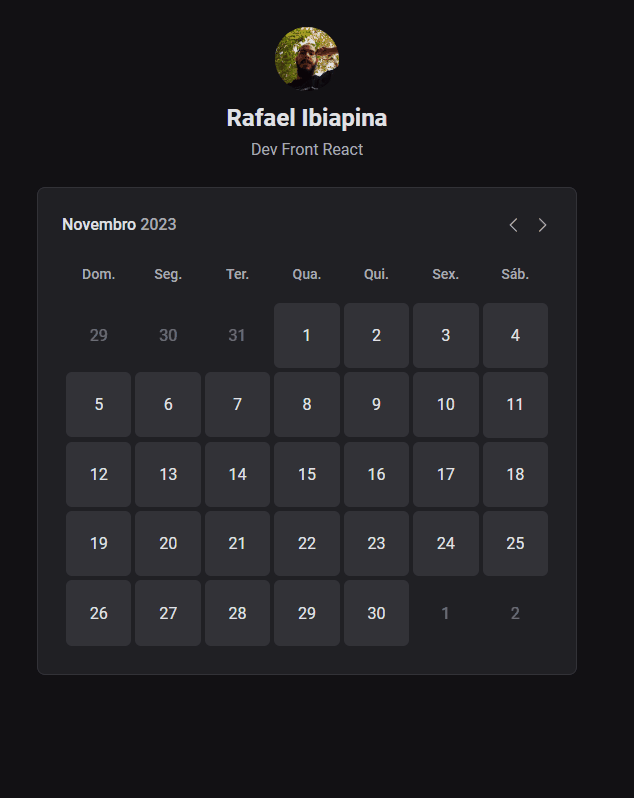

# Ignite Call📅

Ignite Call é uma aplicação Full-stack de agendamentos que permite aos usuários compartilhar seu calendário e permitir que outros reservem horários disponíveis. A aplicação está sendo desenvolvida com React, Next.js e TypeScript e utiliza o <a href="https://github.com/RafaelMatos/design-system2" target="_blank">Design System</a> desenvolvido durante o curso da Rocketseat. Nela foi desenvolvido rotas autenticadas no Next.js, integração com Google Calendar, validações , conceito de Backend-for-Frontend e já conta com as seguintes funcionalidades:
<ul>
    <li>Registro e login de usuários</li>
    <li>Conexão com o Google Calendar</li>
    <li>Definição de intervalos de horários disponíveis</li>
    <li>Atualização do perfil do usuário</li>
    <li>Agendamento de horários</li>
</ul>

<a href="https://ignite-call-rm.vercel.app/">Acesse a aplicação</a>


<details>
    <summary>Responsivo</summary>
    
</details>

## Tecnologias usadas ⚙

- Next.js
- React.js
- Typescript
- Ignite-ui
- Zod
- React Hook Form
- Prisma
- Axios
- Nookies
- NextAuth.js
- DayJs
- Google Apis
- Cloudinary

## Atualizações 🔃

  <details>
    <summary>Histórico</summary>

      - Adicionado a configuração pageExtensions do Next.js;

      - Começando a construção do componente Home;

      - Adicionando componente ClaimUsernameForm à Home;

      - Adicionada validação com zod em ClaimUsernameForm;

      - Construindo página de registro;

      - Salvando usuário no banco utilizando o Prisma;

      - Utilizando o Nookies para pegar nos cookies os dados de usuário salvo;

      - Construindo página de conexão com Google Calendar;

      - Fazendo autenticação oAuth2 para acessar APIs do Google  utilizando o NextAuth.js;

      - Criado um novo Prisma Adapter para o NextAuth;

      - Finalizado autenticação com Google, com permissão ao Calendar.

      - Criada página de intervalo de horários;

      - Adicionada validação do checkbox;

      - Adicionada validação do input de horario inicial e final;

      - Salvando intervalo de horário em banco de dados;

      - Criada pagina de atualização do usuário;

      - Salvando bio do usuário no banco de dados.

    
</details>

  - Criando página de agendamento;

  - Estrutura de Calendario e TimePicker criados;

  - Criada página de confirmação;

  - Criado formulário de confirmação.

  - Calendário alimentado com datas reais;

  - Bloqueando datas sem horário livre;

  - Mudança de banco de dados para o Mysql;

  - Calendario redirecionando para página de confirmação de agendamento;

  - Salvando agendamento no banco de dados;

  - Criando evento no Google Calendar do usuário;

  - Fazendo update de avatar e upload no Cloudinary.

  
  
  

## Como utilizar

- Clone o projeto do repositório

```
git clone https://github.com/RafaelMatos/ignite-call
```

- Acesse a pasta do projeto

```
cd ignite-call
```

- Instale as dependências

```
npm install
```
- Criar arquivo .env com as chaves necessarias( seguir arquivo .envExample)

- Inicializa o Prisma( Usar banco de dados de sua preferencia, no exemplo é usado o mysql)

```
npx prisma init --datasource-provider mysql
```
- Realiza as migrations do Prisma

```
npx prisma migrate dev --name init
```

- Execute o projeto

```
npm run dev
```

- Acesse no navegador o endereço indicado no terminal
